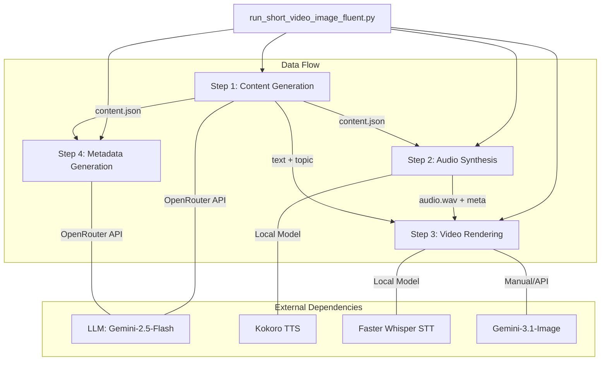

# Research Architecture Overview: Short Video Generation Pipeline

This document provides a technical overview of the `short_video_image_fluent` project, detailing its architecture, processing flow, and technology stack.

## System Architecture

The project follows a modular, 4-step pipeline architecture orchestrated by a central runner script. Each step is independent and persists its state in a project-specific directory.



## Detailed Processing Flow

### 1. Content Generation (`step1_generate_content.py`)
- **Inputs**: Theme, Topic, or Manual Text.
- **Logic**: Uses LLM (via OpenRouter) to generate highly specific, natural monologue scripts (~100-120 words).
- **Outputs**: `01_content/content.json` containing the topic, title, text, difficulty, and hashtags.

### 2. Audio Synthesis (`step2_generate_audio.py`)
- **Inputs**: `content.json`.
- **Logic**: Uses the **Kokoro TTS** library to synthesize human-like audio. It splits text by sentences and adds controlled pauses (150ms) to maintain a fast-paced short-form rhythm.
- **Outputs**: `02_audio/audio.wav` and `audio_meta.json`.

### 3. Video Rendering (`step3_generate_video.py`)
- **Inputs**: `content.json`, `audio.wav`, and a cover image.
- **Logic**:
    - **Timing**: Uses **Faster Whisper** to extract precise word-level timestamps from the audio.
    - **Visuals**: Orchestrates **MoviePy** to composite a 9:16 video.
    - **Sync**: Implements a custom "Karaoke" highlight system that syncs text animations with audio playback.
    - **Layout**: Splits the screen into a top visual section and a bottom text/background section.
- **Outputs**: `03_video/final_short.mp4` and `render_status.json`.

### 4. Metadata Generation (`step4_generate_metadata.py`)
- **Inputs**: `content.json`.
- **Logic**: Generates YouTube SEO-friendly titles and descriptions using a predefined Markdown template and LLM assistance.
- **Outputs**: `04_metadata/youtube_metadata.md`.

## Technology Stack

| Component | Library / Service |
| :--- | :--- |
| **Orchestration** | Python 3.x, Subprocess |
| **LLM (Text/Metadata)** | Google Gemini 2.5 Flash (via OpenRouter) |
| **TTS (Speech)** | Kokoro-82M |
| **STT (Timings)** | Faster Whisper (Large-v3) |
| **Video Editing** | MoviePy, FFmpeg |
| **Image Processing** | PIL (Pillow) |
| **Audio Processing** | Pydub, Soundfile |

## Directory Structure

Projects are organized by date and topic slug under the `output/short_video/` directory:

```text
output/short_video/YYYY-MM-DD/HHMMSS_topic_slug/
├── 01_content/
│   └── content.json
├── 02_audio/
│   ├── audio.wav
│   └── audio_meta.json
├── 03_video/
│   ├── cover.png
│   ├── final_short.mp4
│   └── render_status.json
└── 04_metadata/
    └── youtube_metadata.md
```
