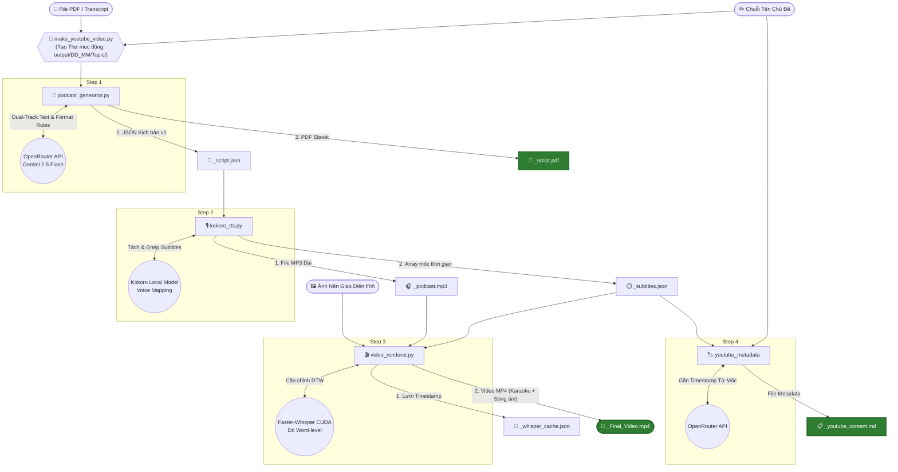

# Make Video With Image - Architecture Overview

Hệ thống **English Podcast Video Pipeline** này nhận đầu vào là một file PDF (chứa transcript) và một chuỗi Chủ đề (topic), sau đó tự động thiết kế, sản xuất ra một video Podcast 20 phút. Hệ thống gồm 4 bước chính phối hợp chặt chẽ với nhau thông qua file theo dõi trạng thái `input/current_output_dir.txt`.

---

## Sơ Đồ Toàn Cảnh (System Architecture)

## 🏗️ Điều Phối Tổng Thể (Orchestration)
**File**: `make_youtube_video.py`

**Luồng hoạt động chính**:
1. Lấy thông tin **PDF Mẫu gốc** và **Chủ đề (Topic)** từ người dùng qua CLI.
2. Sinh ra thư mục lưu trữ động, ví dụ: `output/28_02_2026/Ten_Chu_De_Viet_Lien/`.
3. Lưu đường dẫn thư mục này vào file trạng thái chung `input/current_output_dir.txt`.
4. Gọi lần lượt 3 script con (`podcast_generator.py`, `kokoro_tts.py`, `video_renderer.py`). Bất kì script nào được gọi lên cũng sẽ tự động đọc thư mục trên để lưu đè output của chính nó vào đó.
5. Cuối cùng, trực tiếp gọi LLM để sinh ra file thông tin MetaData của Youtube dựa trên Log thời gian chính xác từ bước 2.

---

## 📝 Bước 1: Tạo Kịch Bản Podcast (LLM)
**File**: `scripts/podcast_generator.py`

Đây là bộ não biên kịch của hệ thống, sử dụng mô hình AI LLM (OpenRouter `google/gemini-2.5-flash`) để chuyển đổi dữ liệu thô thành kịch bản phân vai.

**Inputs**:
- `input/pdf_content/<file_name>.pdf`: File PDF chứa kiến thức/bài học nền.
- Tham số `topic_name` (Chủ đề chính xác).
- `input/current_output_dir.txt`.

**Cơ Chế Hoạt Động (LLM Prompts)**:
- **Casting (Phân vai)**: Bắt buộc đổi tên 2 MC Host thành Alex (nam, phân tích) và Sarah (nữ, cởi mở). Nếu có diễn viên phụ đóng kịch (Roleplay), bắt buộc phải có tên trong dàn Cast (Michael, Nicole, Adam, Sky) để khớp với giọng của bộ TTS phía sau.
- **Form Kịch Bản Đa Lớp (Dual-Track)**: LLM bắt buộc xuất ra JSON gồm 2 trường văn bản cho mỗi thoại:
  - `text_display`: Văn bản chuẩn ngữ pháp để hiển thị nội dung trên màn hình (Karaoke) và gắn vào PDF Ebook.
  - `text_tts`: Văn bản dành riêng cho máy đọc TTS Kokoro. LLM gắn thêm mã điều hướng giọng đọc cho cảm xúc tự nhiên, ví dụ nhấn mạnh lượng từ `[extremely](+2)`, thu nhỏ filler word `[like](-1)`, hoặc dùng dấu `-` / `...` để ép máy dừng nghỉ.
- **Quy Tắc Lõi JSON**: Cấm dùng ngoặc kép (") vô cớ trong content để không làm vỡ cấu trúc JSON parser.
- **Quy Tắc Đầu Đề (Intro Heading)**: Đầu đề số 1 trên thẻ `heading` phải bị "Mute" âm thanh (Gán trống chuỗi rỗng `""`), sau đó ép buộc MC Host (Alex) ra mặt đọc lời thoại dưới cục `dialogue` ở block tiếp theo.

**Outputs (Lưu tại thư mục động)**:
- `_script.json`: Kịch bản gốc dành cho máy (chuỗi mã JSON).
- `_script.pdf`: Kịch bản e-book đẹp mắt dùng cho người đọc (gen qua thư viện `fpdf`).

---

## 🎙️ Bước 2: Chuyển Văn Bản Thành Giọng Nói (TTS)
**File**: `scripts/kokoro_tts.py`

Pipeline âm thanh AI sử dụng model Kokoro (chạy offline/local) để biến `_script.json` thành 1 cục tệp MP3 Master chất lượng cao.

**Inputs**:
- File kịch bản `_script.json` (từ Bước 1).
- `input/current_output_dir.txt`.

**Cơ Chế Hoạt Động**:
- **Trích Xuất & Gắn Giọng**: Lấy mảng JSON, quét từng Block. Tìm Voice Clone theo luật map: Alex (`am_puck`), Sarah (`af_bella`)...
- **Cắt Bỏ Intro Heading**: Hardcode chặn phát Âm thanh nếu chạm mặt Block 1 (Intro heading trống), nhưng vẫn lưu chỉ số Timestamp `00:00`.
- **Tạo Khoảng Thở Lời Dẫn**: Mỗi khi MC đọc xong Heading (Chuyển mục), Code chèn tự động `0.3 giây` tĩnh lặng (Silence Pause) vào sau Audio để tạo nhịp thở chuyển cảnh.
- **Đóng Ghép Track Liên Tục**: Nối nối tiếp từng file audio nhỏ của từng đoạn Dialogue lại thành 1 Track MP3 khổng lồ (20 phút). Tính toán và theo dõi siêu cẩn thận thời gian bắt đầu `start_time` và kết thúc `end_time` của TỪNG câu thoại.

**Outputs (Lưu tại thư mục động)**:
- `_podcast.mp3`: Tệp âm thanh ghép nối hoàn chỉnh.
- `_subtitles.json`: Chứa trọn nội dung Kịch bản NHƯNG **được bồi đắp thêm mốc thời gian tuyệt đối** (`start`, `end`, `duration`) của nội dung tính trên đường ray Track tổng MP3. Đây là nền móng để render Video.

---

## 🎬 Bước 3: Render Video (Karaoke + Visualizer Hình Ảnh)
**File**: `scripts/video_renderer.py`

Hợp nhất Hình nền tĩnh, Audio MP3 và file định vị Subtitles để sinh ra Video MP4.

**Inputs**:
- Giao diện ảnh: `input/image/image_input.png`.
- Tệp âm thanh Master: `_podcast.mp3`.
- File định vị mốc thời gian: `_subtitles.json`.

**Cơ Chế Hoạt Động**:
1. **Dò Thời Gian Từng Từ (Word-Level Timestamps)**: Dữ liệu Subtitles ở Bước 2 là theo Từng Câu. Tool xài **Faster-Whisper (CUDA)** quét ngược cái file MP3 để dò lại mốc thời gian chính xác đến từng mili-giây cho TỪNG TỪ MỘT. 
2. **Thuật Toán Canh Lề DTW**: Ghép nối khối từ vừa nghe (Whisper sai chính tả) đối chiếu chồng lấp với kịch bản (JSON chuẩn chính tả) qua thuật toán khoa học Dynamic Time Warping (DTW) để khớp mốc ăn dính 100%. Cache lại map mốc thời gian này ra file (`_whisper_cache`).
3. **Vẽ Sóng Âm (Visualizer)**: Xử lý FFT tách dải Tần Số Logarithmic của âm thanh trên Track, phân hóa thành 35 cột sóng âm nhấp nhô theo giọng nói. Đặt độ nhảy ở nửa thân dưới ảnh. 
4. **Vẽ Karaoke**: Đi qua từng khung hình Video (10 khung hình một giây), chiếu dò Timeline hiện tại rớt vào mốc thẻ từ vựng nào. Dùng `Pillow (PIL)` vẽ lớp chữ chồng, đổi màu riêng biệt dựa theo người nói (Sarah Vàng, Alex Xanh Mòng Két).

**Outputs (Lưu tại thư mục động)**:
- `_whisper_cache.json`: Bộ đệm chống lặp dùng lần sau nỡ có render đứt gánh.
- `_Final_Video.mp4`: Video đầu cuối hoàn mỹ sẵn sàng đem quăng lên kênh Mạng xã hội.

---

## 🏷️ Bước Phụ: Tạo Siêu Dữ Liệu SEO YouTube (Metadata)
**File**: Tích hợp phần đuôi của `make_youtube_video.py`

Sử dụng trực tiếp LLM để SEO Tối ưu trước khi chủ kênh đăng clip.

**Inputs**:
- Thông tin Tên Chủ Đề truyền vào từ đầu.
- Trích xuất 100% dữ liệu mốc thời gian khởi điểm của các `type: "heading"` trong cái `_subtitles.json` ở Bước 2.

**Cơ Chế LLM**:
LLM được cấp sẵn Data mốc thời gian có từ TTS. Prompt bắt buộc nó viết tiêu đề Giật Tít, Meta description cuốn hút, Hagtag và BẮT BUỘC chèn mốc **Time Stamps Chapter (Chương Video)** chuẩn xác 100% với file MP4.

**Outputs (Lưu tại thư mục động)**:
- `_youtube_content.md`: Tài liệu Copy-Paste dán thẳng vào trình tải Video YouTube với đầy đủ bộ chốt thời gian đánh dấu các phân đoạn Act 1, Act 2 của Clip.
